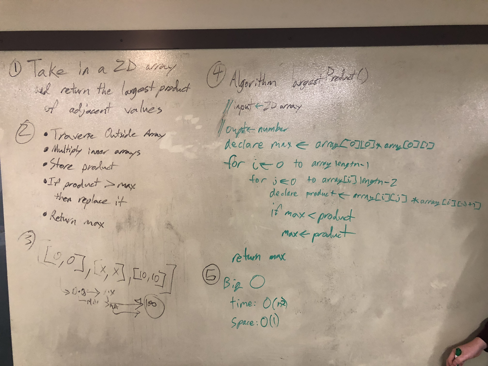

# Largest Product of two adjacent values in a 2d array
A 2d array is basically a matrix. They are frequently used in computers and/or linear algebra.
For a human, they look something like this:

```
|	11	23	45	23	|
|	3	-5	241	2	|
|	22	21	6	42	|
```

## Challenge
This challenge is to find the largest product that can be produced by mulitplying two adjacent elements of the array together. Adjacent is left, right, top or bottom. In the above matrix, for example, the largest product would be 10845.

## Solution
This was the intial whiteboard, although we took a narrower interpretation of adjacent than was intended.
