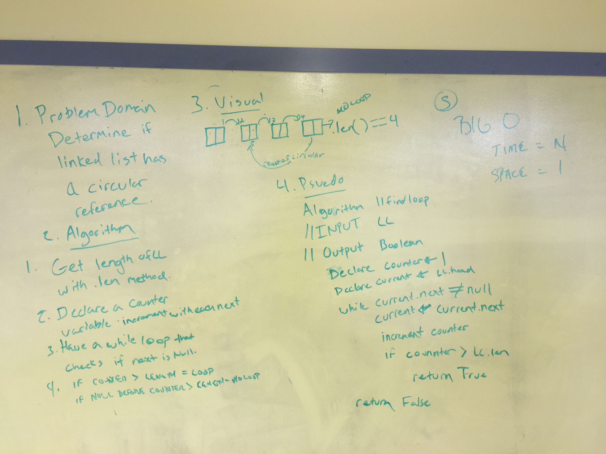

# Identify a Circular Reference
## Challenge
Write a method for the LinkedList class that will identify if the singly linked list is circular. If it is not, return false. If it is, return true.

## Solution
note: we worked assuming length was a property we'd be allowed to use (because we had built it into our own LL implementations). Because length is not a standard property and not one we are allowed to utilize, the code and psuedo code do not match.
