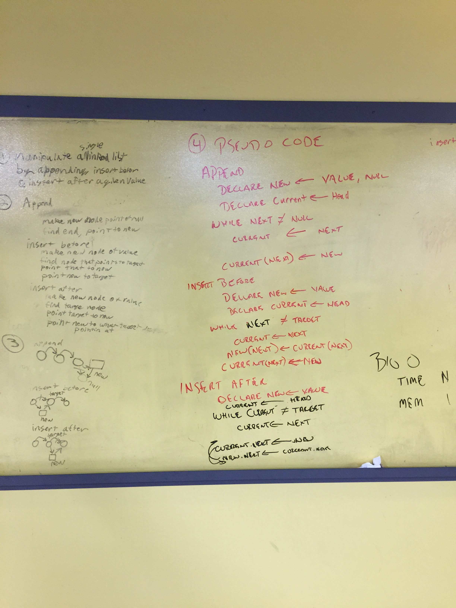

# Linked List Insertions
## Challenge
Build methods to append a node to the end of a linked list, insert a node before the first instance of value in a list, and insert a node after a first instance of value in a list.

## Solution

