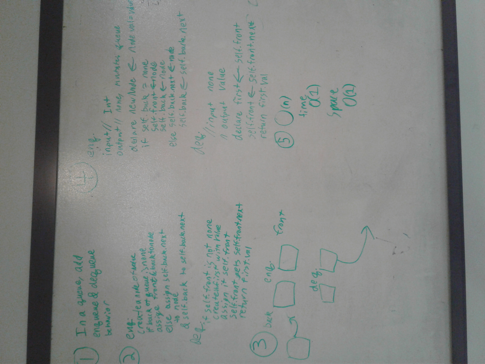

# Implement A Queue with two stacks
This challenge is to simulate the desired behavior of a queue by utilizing two stacks
## Challenge
Using two stacks, write dequeue and enqueue methods in Program that will allow the user to enqueue and dequeue in a FIFO order.

## Solution
the following image is not actually a picture of the implemented solution
