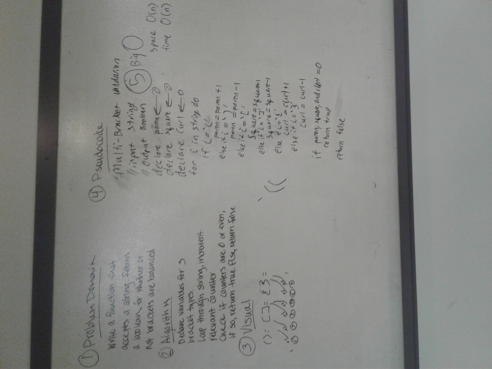

# Multi Bracket Validation
Make sure brackets are closed properly and are actually valid.
## Challenge
Take in a string amd make sure all brackets in the string are valid. Valid is:
'[]' or '{blue([g]elephant)red}[({})]'
In brief: every bracket that opens must close and close in order, with no unused close brackets.

## Solution
until we asked clarifying questions, the problem domain had some vagueness. Our original solution took advantage.
