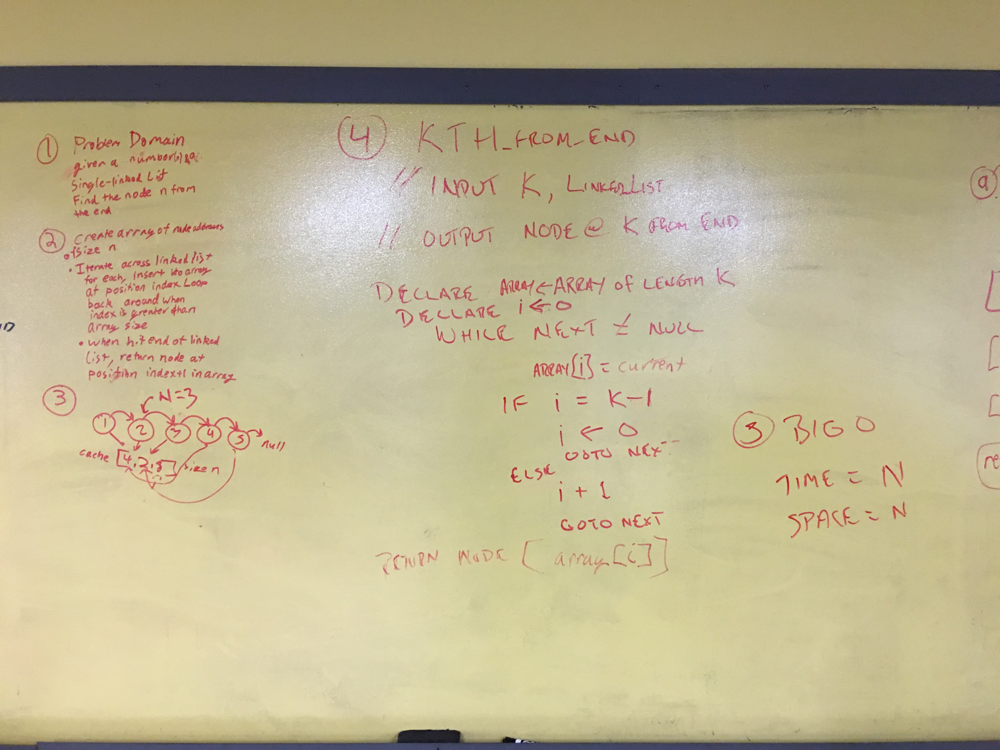

# kth from end of a linked list
## challenge
Given a linked list and a value of k, find the node n that is k from the end of the list. Zero index so the last node on the list would be 0 from the end.

## solution

