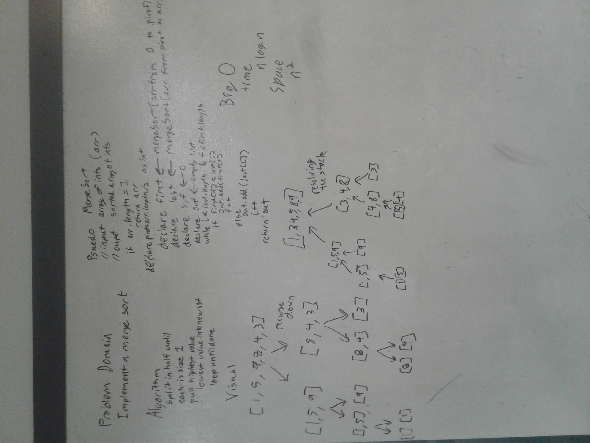

# Merge Sort
Merge sort is an algorithm that recursively divides and conquers. Then, having divided, compares and combines by always pulling the smaller value of the two halves it is merging. Once both halves are empty, the merge is complete.

# Solution
